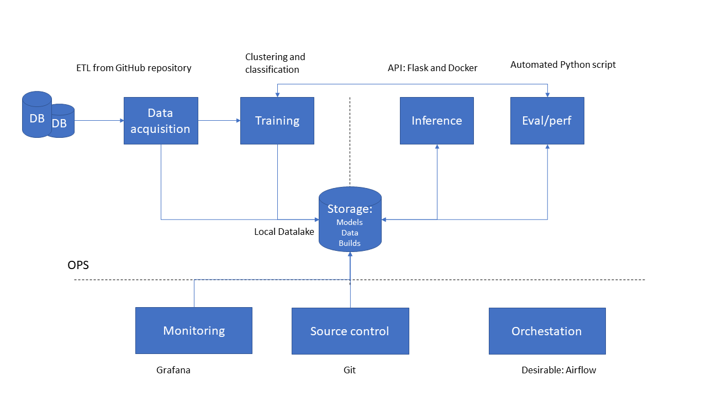

# simulating-mlops-lifecyle

This is a project to replicate the conditions and procedures in a production enviroment of MLOps.

So here we will find how to approximate the MLOps without cloud infrastructure, but it can be extrapolated to cloud changing some functions and paths.

## Problem to solve:

We have a dataset with customer raw data from a bank. We want to find groups through clustering and then use a classification algorithm to train a model that can make predictions on unseen data compute the probability of the classes.

### Steps to replicate this repo:

```sh
git clone <ssh code>
pip install pipenv
pipenv shell
pipenv install
```

### Metrics:
- Silohuette Score: 0.1245
- Accuracy of clasiffication model: 97.40%

## The simulated MLOps architechture:



